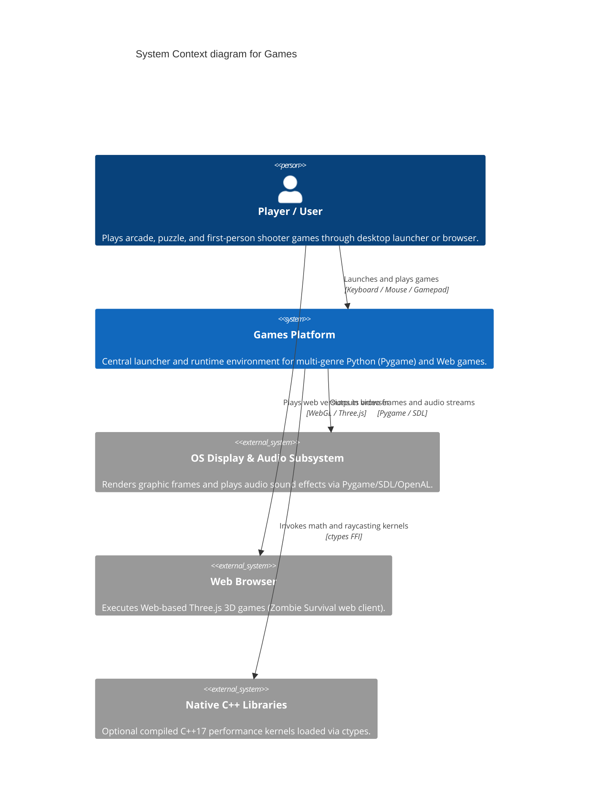
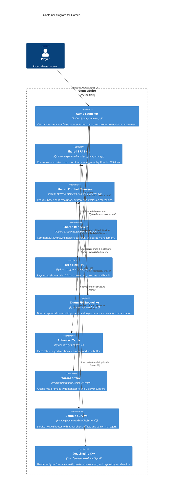

# Architecture Map — Games

This document defines the canonical Mermaid C4 architecture map for `Games`, providing verified context, container boundaries, capability-to-component traceability, and architecture change history.

## Context View (C4Context)

## Container View (C4Container)

## Feature Map

| Capability | Component | Interface | Evidence |
| --- | --- | --- | --- |
| Central Game Launcher | `games.game_launcher` | `GameLauncher.run()`, game discovery | `tests/test_game_loop_integration.py` |
| Shared FPS Base & Loop | `src.games.shared.fps_game_base` | `FPSGameBase`, state dispatch | `tests/shared/test_fps_game_base.py` |
| Shared Combat & Explosions | `src.games.shared.combat_manager` | `CombatManager.resolve_shot()` | `tests/shared/test_combat_manager.py` |
| Force Field Raycasting FPS | `src.games.Force_Field` | `Game.run()`, raycaster renderers | `tests/Force_Field/test_gameplay.py` |
| Duum Procedural Roguelike | `src.games.Duum` | `Game.run()`, dungeon generation | `tests/Duum/test_gameplay.py` |
| Enhanced Tetris Logic | `src.games.Tetris` | `TetrisGame.run()`, board mechanics | `tests/tetris/test_tetris.py` |
| Wizard of Wor Arcade Remake | `src.games.Wizard_of_Wor` | `Game.run()`, maze progression | `tests/test_game_mechanics.py` |
| Zombie Survival Wave Shooter | `src.games.Zombie_Survival` | `Game.run()`, atmosphere & spawn | `tests/Zombie_Survival/test_gameplay.py` |
| Design-by-Contract Validation | `src.contracts` | `preconditions`, `postconditions` | `tests/test_architecture_dbc.py` |
| Workflow Python Hygiene | `.github/workflows` | Static inline Python AST analysis | `tests/test_workflow_python_hygiene.py` |

## Architecture Change Log

| Date | PR / Issue | Description |
| --- | --- | --- |
| 2026-09-10 | #1599 | Adopt maintainable Mermaid C4 architecture-map contract and automated CI verification |
