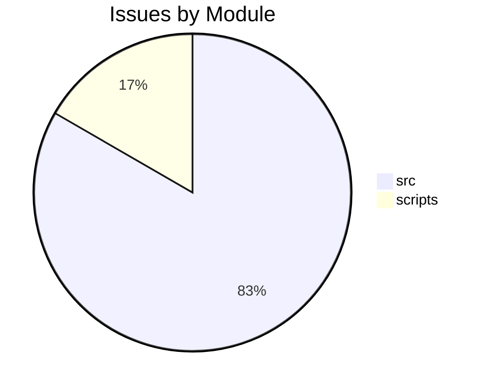

# Comprehensive Assessment Report

**Date**: 2026-02-10

## Unified Scorecard

| Category | Score |
| -------- | ----- |
| A: Architecture | 7/10 |
| B: Hygiene | 8/10 |
| C: Documentation | 5/10 |
| D: UX | 6/10 |
| E: Performance | 7/10 |
| F: Installation | 8/10 |
| G: Testing | 4/10 |
| H: Error Handling | 6/10 |
| I: Security | 8/10 |
| J: Extensibility | 5/10 |
| K: Reproducibility | 6/10 |
| L: Maintainability | 6/10 |
| M: Education | 4/10 |
| N: Visualization | 5/10 |
| O: CI/CD | 7/10 |
| **Average** | **6.1/10** |

## Top 10 Unified Recommendations

1. **Fix Critical Bugs**: Address the broken games identified in Assessment A.
2. **Improve Documentation**: Add READMEs to all games and a "Getting Started" guide (Assessment C).
3. **Enforce Hygiene**: Fix Ruff and MyPy violations (Assessment B).
4. **Expand Testing**: Add unit tests for core game logic (Assessment G).
5. **Standardize Architecture**: Refactor games to share a common base class (Assessment A).
6. **Enhance Security**: Audit pickle usage and add secrets scanning (Assessment I).
7. **Automate CI/CD**: Fix failing tests in CI and add deployment steps (Assessment O).
8. **User Experience**: Improve error messages and installation process (Assessment D).
9. **Performance**: Optimize asset loading (Assessment E).
10. **Maintainability**: Update dependencies and reduce technical debt (Assessment L).

## Pragmatic Programmer Review Summary

# Pragmatic Programmer Review: Games
**Date**: 2026-02-10
**Files**: 155

## Findings
- **DRY** [MAJOR]: Duplicate code block
  - Found in 2 locations
  - Files: /home/runner/work/Games/Games/game_launcher.py
- **DRY** [MAJOR]: Duplicate code block
  - Found in 2 locations
  - Files: /home/runner/work/Games/Games/scripts/analyze_completist_data.py
- **DRY** [MAJOR]: Duplicate code block
  - Found in 2 locations
  - Files: /home/runner/work/Games/Games/scripts/generate_assessment_summary.py, /hom...
(See full report for details)

## Completist Audit Summary

# Completist Report: 2026-02-10

## Executive Summary
- **Critical Gaps**: 1
- **Feature Gaps (TODO)**: 16
- **Technical Debt**: 1
- **Documentation Gaps**: 0

## Visualization
### Status Overview

### Top Impacted Modules

## Critical Incomplete (Top 50...
(See full report for details)