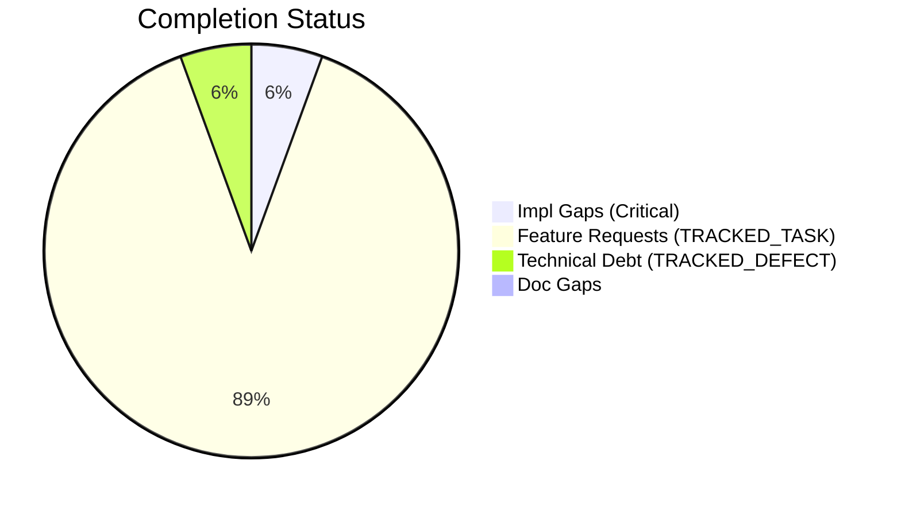
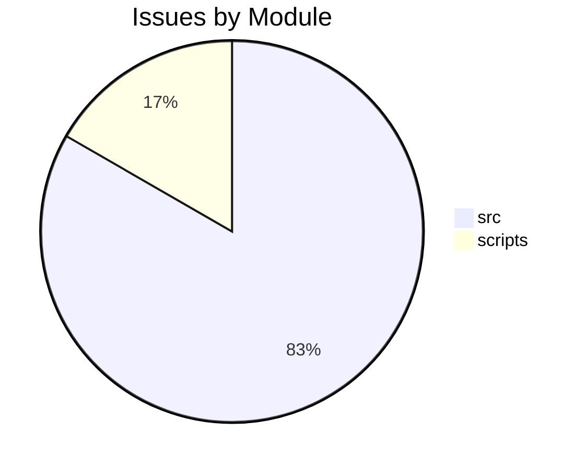

# Completist Report: 2026-02-17

## Executive Summary
- **Critical Gaps**: 1
- **Feature Gaps (TRACKED_TASK)**: 16
- **Technical Debt**: 1
- **Documentation Gaps**: 0

## Visualization
### Status Overview

### Top Impacted Modules

## Critical Incomplete (Top 50)
| File | Line | Type | Impact | Coverage | Complexity |
|---|---|---|---|---|---|
| `./scripts/shared/quality_checks_common.py` | 13 | NotImplementedError | 1 | 2 | 4 |

## Feature Gap Matrix
| Module | Feature Gap | Type |
|---|---|---|
| `./src/games/vendor/three/three.module.js` | // TRACKED_TASK lengthSquared? | TRACKED_TASK |
| `./src/games/vendor/three/three.module.js` | //TRACKED_TASK: make this more efficient | TRACKED_TASK |
| `./src/games/vendor/three/three.module.js` | // TRACKED_TASK: Copied from Object3D.toJSON | TRACKED_TASK |
| `./src/games/vendor/three/three.module.js` | // TRACKED_TASK (abelnation): RectAreaLight BRDF data needs to be moved from example to main src | TRACKED_TASK |
| `./src/games/vendor/three/three.module.js` | // TRACKED_TASK Attribute may not be available on context restore | TRACKED_TASK |
| `./src/games/vendor/three/three.module.js` | // TRACKED_TASK Send this event to Three.js DevTools | TRACKED_TASK |
| `./src/games/vendor/three/three.module.js` | // TRACKED_TASK (abelnation): set RectAreaLight shadow uniforms | TRACKED_TASK |
| `./src/games/vendor/three/three.module.js` | // TRACKED_TASK : do it if required only | TRACKED_TASK |
| `./src/games/vendor/three/three.module.js` | // TRACKED_TASK: Uniformly handle mipmap definitions | TRACKED_TASK |
| `./src/games/vendor/three/three.module.js` | newRenderTarget.isXRRenderTarget = true; // TRACKED_TASK Remove this when possible, see #23278 | TRACKED_TASK |
| `./src/games/vendor/three/three.module.js` | // TRACKED_TASK: Better way to apply this offset? | TRACKED_TASK |
| `./src/games/vendor/three/three.module.js` | // TRACKED_TASK (abelnation): add area lights shadow info to uniforms | TRACKED_TASK |
| `./src/games/vendor/three/three.module.js` | this.currentPoint.set( x, y ); // TRACKED_TASK consider referencing vectors instead of copying? | TRACKED_TASK |
| `./src/games/vendor/three/three.module.js` | this.intensity = json.intensity; // TRACKED_TASK: Move this bit to Light.fromJSON(); | TRACKED_TASK |
| `./src/games/vendor/three/three.module.js` | // TRACKED_TASK: delete this comment? | TRACKED_TASK |
| `./scripts/shared/quality_checks_common.py` | (re.compile(r"\bTODO\b"), "TRACKED_TASK placeholder found"), | TRACKED_TASK |

## Technical Debt Register
| File | Line | Issue | Type |
|---|---|---|---|
| `./scripts/shared/quality_checks_common.py` | 11 | (re.compile(r"\bFIXME\b"), "TRACKED_DEFECT placeholder found"), | TRACKED_DEFECT |

## Recommended Implementation Order
Prioritized by Impact (High) and Complexity (Low).
| Priority | File | Issue | Metrics (I/C/C) |
|---|---|---|---|
| 1 | `./src/games/vendor/three/three.module.js` | // TRACKED_TASK lengthSquared? | 1/2/3 |
| 2 | `./src/games/vendor/three/three.module.js` | //TRACKED_TASK: make this more efficient | 1/2/3 |
| 3 | `./src/games/vendor/three/three.module.js` | // TRACKED_TASK: Copied from Object3D.toJSON | 1/2/3 |
| 4 | `./src/games/vendor/three/three.module.js` | // TRACKED_TASK (abelnation): RectAreaLight BRDF data needs to be moved from example to  | 1/2/3 |
| 5 | `./src/games/vendor/three/three.module.js` | // TRACKED_TASK Attribute may not be available on context restore | 1/2/3 |
| 6 | `./src/games/vendor/three/three.module.js` | // TRACKED_TASK Send this event to Three.js DevTools | 1/2/3 |
| 7 | `./src/games/vendor/three/three.module.js` | // TRACKED_TASK (abelnation): set RectAreaLight shadow uniforms | 1/2/3 |
| 8 | `./src/games/vendor/three/three.module.js` | // TRACKED_TASK : do it if required only | 1/2/3 |
| 9 | `./src/games/vendor/three/three.module.js` | // TRACKED_TASK: Uniformly handle mipmap definitions | 1/2/3 |
| 10 | `./src/games/vendor/three/three.module.js` | newRenderTarget.isXRRenderTarget = true; // TRACKED_TASK Remove this when possible, see  | 1/2/3 |
| 11 | `./src/games/vendor/three/three.module.js` | // TRACKED_TASK: Better way to apply this offset? | 1/2/3 |
| 12 | `./src/games/vendor/three/three.module.js` | // TRACKED_TASK (abelnation): add area lights shadow info to uniforms | 1/2/3 |
| 13 | `./src/games/vendor/three/three.module.js` | this.currentPoint.set( x, y ); // TRACKED_TASK consider referencing vectors instead of c | 1/2/3 |
| 14 | `./src/games/vendor/three/three.module.js` | this.intensity = json.intensity; // TRACKED_TASK: Move this bit to Light.fromJSON(); | 1/2/3 |
| 15 | `./src/games/vendor/three/three.module.js` | // TRACKED_TASK: delete this comment? | 1/2/3 |
| 16 | `./scripts/shared/quality_checks_common.py` | (re.compile(r"\bTODO\b"), "TRACKED_TASK placeholder found"), | 1/2/3 |
| 17 | `./scripts/shared/quality_checks_common.py` | (re.compile(r"NotImplementedError"), "NotImplementedError placeholder"), | 1/2/4 |

## Issues Created