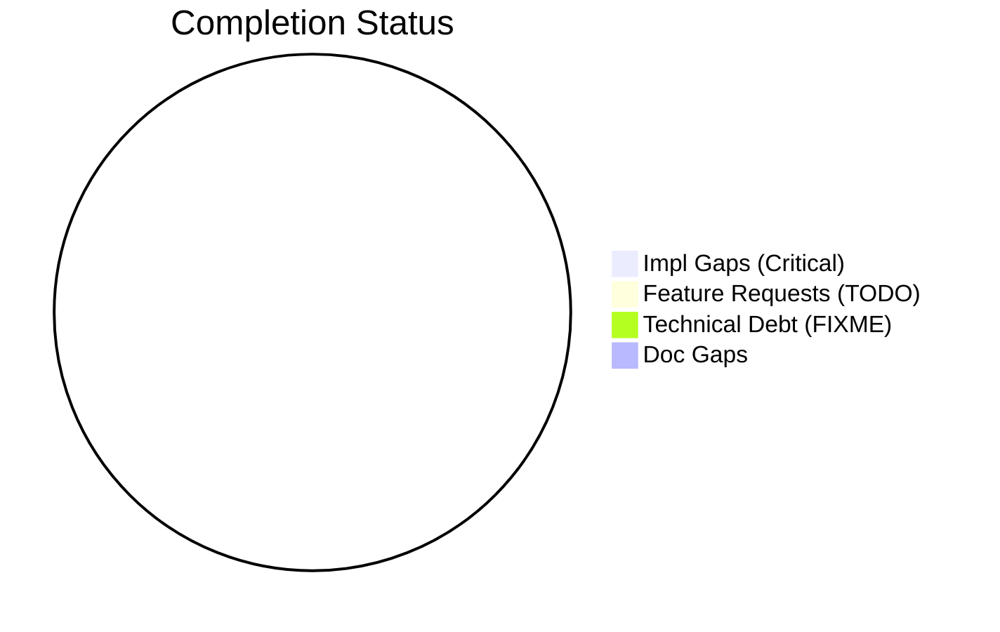

# Completist Report: 2026-01-31

## Executive Summary
- **Critical Gaps**: 0
- **Feature Gaps (TODO)**: 0
- **Technical Debt**: 0
- **Documentation Gaps**: 0

## Visualization
### Status Overview

## Critical Incomplete (Top 50)
| File | Line | Type | Impact | Coverage | Complexity |
|---|---|---|---|---|---|

## Feature Gap Matrix
| Module | Feature Gap | Type |
|---|---|---|

## Technical Debt Register
| File | Line | Issue | Type |
|---|---|---|---|

## Recommended Implementation Order
Prioritized by Impact (High) and Complexity (Low).
| Priority | File | Issue | Metrics (I/C/C) |
|---|---|---|---|

## Issues Created