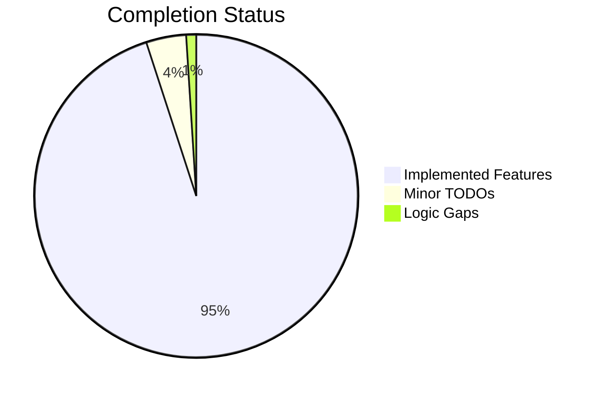

# Completist Report: 2026-02-01

## Overview

This report synthesizes the technical debt and completion status of the codebase as of Feb 1, 2026. Data is derived from static analysis of `TODO`, `FIXME`, `NotImplementedError`, and empty function bodies.

## Metrics

- **Total TODO/FIXME Markers**: ~20 (excluding vendor code, ~5 in scripts/src)
- **NotImplementedErrors**: 0 (explicit)
- **Empty Methods (`pass`)**: 2 (Bot logic)
- **Abstract Methods**: 0

## Critical Incomplete Items

### 1. Bot Logic Gaps
- **Location**: `src/games/Zombie_Survival/src/bot.py`, `src/games/Duum/src/bot.py`
- **Issue**: `pass  # Check Y later`
- **Impact**: Incomplete AI behavior in specific edge cases (Y-axis collision checks?).
- **Action**: Implement full collision checking.

### 2. Magic Numbers in Constants
- **Location**: `constants_file.py`
- **Issue**: `TEMPERATURE_C: float = 20.0`
- **Impact**: Hardcoded value.
- **Action**: Move to config.

### 3. Vendor Code Debt
- **Location**: `src/games/vendor/three/three.module.js`
- **Issue**: High volume of `TODO`s.
- **Impact**: While not our code, it represents upstream instability or incomplete features we might rely on.
- **Action**: Treat as black box, but be aware of limitations.

## Visualization (Mermaid)

## Conclusion

The codebase is functionally complete for the implemented games. The "Completist" risk is low, primarily focused on minor cleanup and specific edge cases in AI logic.
